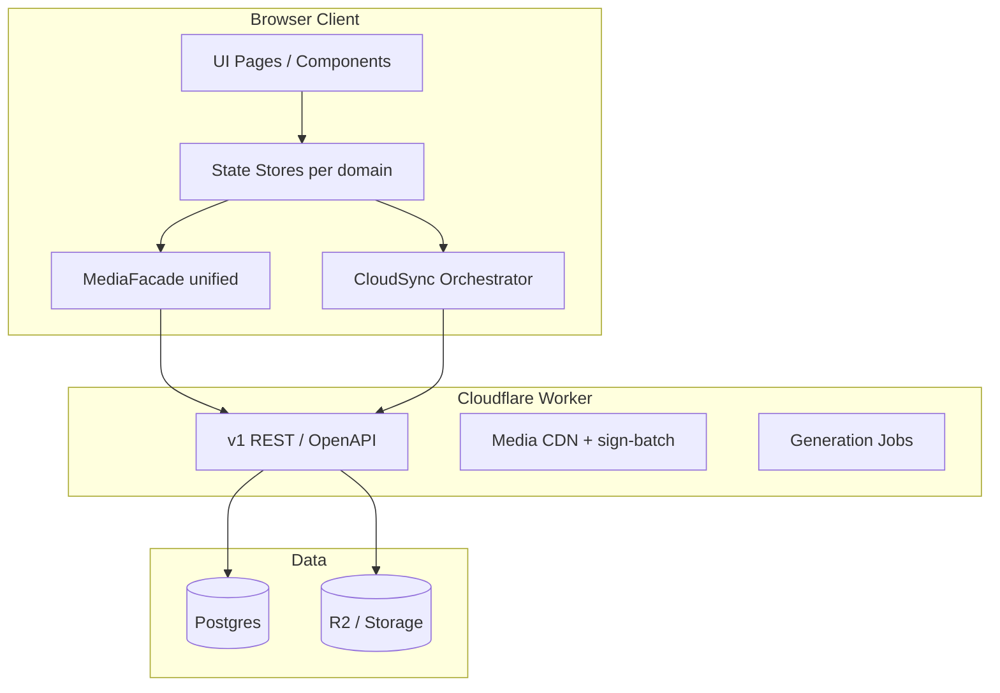

# Fable5 项目重构简报（低成本 · 现代化 · 可维护）

> **用途**：把本文 **整份** 作为 Fable5 的首条上下文，让它输出「重构蓝图 + 分阶段计划」，而不是直接重写全站。  
> **读者**：Fable5 / 架构 AI + 产品负责人（非专业开发者）。  
> **仓库**：`d:\prompt-hub` · 线上 https://prompt-hubs.com · API https://api.prompt-hubs.com  
> **最后更新**：2026-07-03

---

## 0. 给 Fable5 的第一条消息（复制即用）

```text
你是资深架构师。请基于附件《FABLE5-REARCHITECT-BRIEF.md》为 Prompt Hub（卡藏）做「最低成本现代化重构」。

约束：
- 禁止 Big Bang 全量重写；必须 Strangler Fig（绞杀者）分阶段迁移，每阶段可独立上线。
- 必须保留现有 Cloudflare Pages + Worker + Supabase/MemFire + R2 部署形态（可演进，不可推翻）。
- 必须列出「不可破坏不变量」的验收方式。
- 产品负责人不懂代码：输出要含优先级、风险、每阶段工时量级（人天）、以及「第一阶段只做哪 3 件事」。

请先输出（不要写代码）：
1. 现状诊断（≤10 条 bullet，引用本 brief 的痛点编号）
2. 目标架构图（文字 + mermaid）
3. 模块边界与目录结构建议（目标态）
4. 分阶段路线图 Phase 0～4（每阶段：目标 / 不动什么 / 验收 / 回滚）
5. 明确「不做清单」（避免 over-engineering）
6. 第一阶段详细任务拆解（≤2 周可完成）

必读仓库文档（若可访问）：docs/ARCHITECTURE-CHANGE-GUARD.md、docs/AI-PITFALLS.md、docs/FILE-MAP.md、docs/DATA-MODEL.md。
```

---

## 1. 产品是什么（边界）

| 在内 | 在外（独立仓库，本 brief 仅接口级） |
|------|-------------------------------------|
| 卡片式提示词仓库（848+ 卡/用户级） | 无限画布 Next.js 应用 `infinite-canvas-jay` |
| 社区 Feed、我的主页 | Chrome 扩展（共用 extension API） |
| 图片/视频生图、积分会员 | Supabase 控制台运维本身 |
| 管理后台 `admin.html` | MemFire 注册/KYC 流程 |
| Cloudflare Worker API | |

**品牌**：对外「卡藏 · 卡片式提示词仓库」；域名 prompt-hubs.com。

---

## 2. 现状架构（2026-07 快照）

### 2.1 部署拓扑

```text
用户浏览器
  → Cloudflare Pages（静态：index.html + 大量 .js/.css，无 bundler 框架）
  → Service Worker sw.js（缓存策略敏感，见 AI-PITFALLS）
  → Cloudflare Worker prompt-hub-api（Hono，TypeScript）
       → Supabase Postgres（user_data JSON、community_posts、generation_requests…）
       → Supabase Storage / R2 card-images（MEDIA_STORAGE_MODE=r2-first）
       → 第三方生图上游（GrsAI、Apimart 等）
```

### 2.2 前端技术债概览

| 文件/区域 | 规模 | 职责（过多耦合） |
|-----------|------|------------------|
| `features-draft.js` | ~9500 行 | 社区、生图、最近生成、Feed 渲染、部分同步 |
| `script.js` | ~5000+ 行 | 卡片库 CRUD、Auth、云同步、导航、批量操作 |
| `supabase-sync.js` | ~4900 行 | 登录、Storage、签名 batch、404 缓存、上传 |
| `feed-layout.js` | ~850 行 | Masonry / flex / 手机 grid |
| `feed-images.js` | ~550 行 | Feed 出图 hydrate |
| `image-gen-feed.js` | ~660 行 | 生图仓库 Feed |
| `card-gallery.js` | ~550 行 | MJ 多图、列表缩略图选择 |
| `card-image-loader.js` | 懒加载、warehouse 绑定 | |
| `server/src/*` | Worker 路由较清晰 | 媒体 CDN、社区、生图、扩展 API |

**构建**：esbuild 打包若干 `pack-*.js` 到站点根目录；`__APP_BUILD__` 手动 bump；**无** React/Vue 全站框架。

### 2.3 数据四层（不可随意合并）

见 `docs/DATA-MODEL.md`：

1. Postgres 表（`community_posts`、`generation_requests`…）
2. `user_data` JSON（cards、communityPosts 副本…）
3. Storage / R2 对象（`{uid}/generated/…`、`{uid}/card_….jpg`）
4. 浏览器 IndexedDB + localStorage（卡片快照、最近生成 7 天、Feed 缓存）

**已知数据一致性问题**（重构须优先建模，而非继续打补丁）：

- 「最近生成」过期清理可能 `purgeCreationMedia` 删除 Storage，但卡片库 metadata 仍指向该路径 → 黑图。
- 卡片库 848 张 vs Storage 实际文件 vs R2 同步集 不完全 1:1。
- 社区帖同时存在于 DB 表 + `user_data.communityPosts` 副本，合并逻辑复杂（`cloud-sync-safety.js`）。

---

## 3. 痛点清单（请 Fable5 按 P0/P1/P2 重新排序并给方案）

| ID | 痛点 | 表现 | 根因方向 |
|----|------|------|----------|
| P1 | **巨型单文件** | 改一行牵动全站；AI/人类都难以定位 | 无模块边界、无类型、无测试 |
| P2 | **图片管线分散** | 卡片库/社区/生图/Feed 各一套 hydrate；黑图、404、签名风暴 | 逻辑散落在 5+ 文件，缺统一 MediaFacade |
| P3 | **双源社区数据** | API Feed vs local JSON vs 卡片派生帖 三源合并 | 历史演进 + 离线优先 |
| P4 | **云同步与 UI 耦合** | 登录、pull、push、merge、tombstone 与 render 交织 | `script.js` + `cloud-sync-safety.js` 编排过重 |
| P5 | **最近生成 vs 卡片库** | 7 天本地列表 vs 永久卡片库；清理误伤 Storage | 生命周期未在数据层统一 |
| P6 | **构建与缓存脆弱** | SW、SPA 回退、pack 路径曾导致全站无图 | 静态托管 + 手工 build 号 |
| P7 | **Worker 与前端契约 implicit** | sign-batch、warehouse-thumbs、recover-warehouse 无 OpenAPI | 前后端靠约定字符串 |
| P8 | **无自动化测试** | 回归靠人工强刷 + Console | 关键路径无 smoke |
| P9 | **MemFire/R2 迁移进行中** | 配置多模板、环境分裂 | 基础设施变更与业务重构叠加风险 |
| P10 | **性能已部分优化但架构未收敛** | 首屏 batch 签名、Masonry 等是补丁式优化 | 缺虚拟列表/统一数据层等结构解法 |

---

## 4. 不可破坏的不变量（重构的硬约束）

Fable5 每个阶段必须保证以下仍成立：

### 4.1 用户数据

- 登录后卡片库数量 **不得无故减少**（tombstone / merge 规则保留或可迁移）。
- `genJobId`、MJ 多槽（`#2`）、`cardImages[]` **不得删除字段**（可 deprecated，需迁移脚本）。
- `storage://card-images/…` 引用格式与 Worker 签名 URL 契约保持兼容或提供双读期。

### 4.2 功能回归面（每阶段 smoke）

| 区域 | 最低验收 |
|------|----------|
| 登录 / 换号 | 不串号、退出清缓存 |
| 卡片库 | 848 量级列表可滚动、缩略图 batch 加载、Masonry 不跳顶 |
| 社区 Feed | API 帖 + 本地帖合并、坏图隐藏不雪崩 |
| 生图 | 扣积分 → 最近生成 → 存入库 |
| 会员 / 兑换 | `/health` ok、积分 UI |
| 扩展 / 画布 API | `GET /extension/cards`、生图代理 |
| 部署 | `deploy-pages.ps1` + `server npm run deploy` 仍可用 |

### 4.3 运维与成本

- **继续** Cloudflare 免费/低付费档位友好（无强制 K8s、无重型 Redis 除非论证必要）。
- 图片 **优先 R2 + Worker CDN**，数据库迁移 MemFire **不与前端大重构同一阶段**。
- 密钥不进 Git；环境：`supabase-config.js`、`server/.dev.vars`、`scripts/admin.local.env`。

### 4.4 明确禁止（见 ARCHITECTURE-CHANGE-GUARD）

- 为修卡片库 **await 全量 prefetch 再插 DOM**。
- 删除 `genJobId` 换「纯普通卡」一步到位。
- 社区与卡片库 **共用一套会清空 Masonry 列** 的 render。
- Big Bang 换框架且同周切流量。

---

## 5. 低成本现代化原则（给 Fable5 的决策准则）

1. **Strangler Fig**：新模块包旧模块；旧入口保留 re-export，直到流量/功能切换完成。
2. **垂直切片优先**：先拿「一条用户路径」走通新架构（建议：**卡片库列表 + 缩略图加载**），不要横向同时改社区+生图+admin。
3. **契约先行**：Worker 已有 TypeScript；先导出 **OpenAPI 或 zod 共享类型**（可 monorepo `packages/shared`），前端后迁。
4. **数据层先于 UI 框架**：先统一 Card / Post / MediaRef / GenerationJob 领域模型与 Repository，再考虑 React/Vue。
5. **测试预算极小但有**：每阶段加 1～3 个 **HTTP smoke**（已有 `scripts/run-index-http-smoke.mjs` 可扩展）+ 1 个 **媒体签名集成测试**。
6. **构建渐进**：可选目标 **Vite + TypeScript（strict 可后置）**，但 Phase 1 允许「TS 编译现有 JS 子集」而非全站 TSX。
7. **不做清单**（除非产品明确要求）：微服务拆分、Kafka、自研 CMS、全站 SSR、移动端原生 App。

---

## 6. 建议目标态（供 Fable5 细化，非强制）

### 6.1 逻辑分层（目标）



### 6.2 目标目录（示意，Fable5 可调整）

```text
prompt-hub/
├── apps/
│   ├── web/              # 原 Pages 前端（Vite 或渐进迁移）
│   └── admin/            # admin 独立小入口（可选后期）
├── packages/
│   ├── shared/           # 类型、常量、API 路径、Card/Post schema
│   ├── media-client/     # 签名、hydrate、404 策略（替代分散逻辑）
│   └── sync/             # merge、tombstone、push/pull 纯函数 + 测试
├── server/               # 现有 Worker（保留，逐步拆 lib/domain）
├── extension/            # 浏览器扩展（共用 packages/shared）
├── scripts/              # 运维脚本保留
└── docs/
```

**关键**：`packages/media-client` 应收拢 `supabase-sync.js` + `warehouse-thumb.js` + `card-image-loader.js` 的 **列表层策略**（batch sign、lazy、missing cache）。

### 6.3 数据生命周期（须写进设计）

| 实体 | 权威源（Source of Truth） | 缓存 | 生命周期 |
|------|---------------------------|------|----------|
| 卡片 Card | `user_data.cards`（长期） | IDB | 永久，删卡 tombstone |
| 生图任务 Job | `generation_requests` | 无 | 长期；repair 用 |
| 最近生成 Creation | 建议 **降级为 Job 的 UI 视图**，非第二份图片源 | localStorage | 7 天 **仅 UI 索引**，清理 **不得 delete Storage 若卡片仍引用** |
| 社区帖 Post | **`community_posts` 表为准**；`user_data` 仅离线草稿 | localStorage | 发布写 DB |
| 图片 Blob | R2 优先，Supabase 回退 | CDN 短缓存 | 与 Card 引用 refcount 或 repair |

---

## 7. 分阶段路线图（最低成本默认建议）

> Fable5 应重新估算工时；下表为 **产品负责人偏好的顺序**。

| 阶段 | 目标 | 不动 | 预估 | 上线标准 |
|------|------|------|------|----------|
| **Phase 0** | 基线：OpenAPI 草案、smoke 扩展、架构 ADR 文档 | 用户可见 UI | 2～3 人天 | CI 跑 smoke；文档合入 `docs/adr/` |
| **Phase 1** | 抽出 `packages/media-client` + 卡片库改用；修复 purge 误伤 | 社区、生图 UI | 1～2 周 | 卡片库黑图率下降；无签名风暴 |
| **Phase 2** | `packages/sync` 纯函数化；`script.js` 瘦身（卡片+同步） | Feed 排版 | 2～3 周 | 登录同步零丢卡；E2E smoke |
| **Phase 3** | 社区单源化：`community_posts` 为权威；弱化 local 副本 | 生图复杂流 | 3～4 周 | Feed 条数与 API 一致 |
| **Phase 4** | Vite+TS 壳；按页迁移（warehouse → community → imagegen） | Worker 大改 | 4～8 周 | 构建一键化；HMR 本地 dev |

**MemFire 切库、R2 历史同步**：独立轨道，与 Phase 1～2 **并行但不同一 PR**。

---

## 8. Fable5 交付物 checklist

- [ ] **ADR-001** 目标架构与「不做清单」
- [ ] **ADR-002** 媒体加载统一设计（序列图：列表渲染 → sign-batch → CDN → 404 → repair）
- [ ] **ADR-003** 社区数据单源迁移策略
- [ ] **模块依赖图**（哪些包可独立 npm workspace）
- [ ] **OpenAPI 3.1**（至少 `/media/*`、`/community/*`、`/generate/*`、`/extension/*`）
- [ ] **Phase 1 任务分解**（文件级：从哪几个函数抽离、旧文件如何 re-export）
- [ ] **风险矩阵**（概率 × 影响 × 缓解）
- [ ] **回滚策略**（每阶段 feature flag 或 build 号切换）
- [ ] **度量指标**：LCP、卡片库首屏 sign 请求数、JS 总传输体积、`script.js`+`features-draft.js` 行数下降曲线

---

## 9. 第一阶段建议只做这 3 件事（默认推荐）

若只能选最小一步，请 Fable5 按此执行：

1. **MediaFacade 原型**  
   - 输入：`Card[]` + viewport  
   - 输出：带 resolved thumb URL 的 view model  
   - 内置：batch sign、missing cache、genJobId → warehouse 分支（与现 `cardNeedsWarehouseThumbServer` 行为一致）

2. **Creation 清理护栏**  
   - `purgeCreationMedia` 前强制检查 **云端卡片库** 是否仍引用同一 `genJobId` / storage path（不仅查本地 `__promptHubCards`）

3. **Smoke 扩展**  
   - 登录态 mock 或 staging 账号：拉 24 张卡签名 + 1 张 MJ 多槽 + `/health` + `/community/feed`

---

## 10. 附录：必读文档索引

| 文档 | 何时读 |
|------|--------|
| `docs/ARCHITECTURE-CHANGE-GUARD.md` | 任何「换架构」决策前 |
| `docs/AI-PITFALLS.md` | 设计 Feed/卡片/签名 时 |
| `docs/ERROR-LOG.md` | 理解历史事故 |
| `docs/FILE-MAP.md` | 函数级导航 |
| `docs/DATA-MODEL.md` | 数据单源设计 |
| `docs/FEED-MODULES.md` | 社区/生图 Feed 边界 |
| `docs/CARD-LOADING.md` | 卡片库加载管线 |
| `docs/MEMFIRE-MIGRATION.md` / `R2-MIGRATION.md` | 基础设施并行轨 |
| `docs/CANVAS-INTEGRATION.md` | 扩展 API 契约 |

---

## 11. 成功长什么样（6 个月后愿景，非 Phase 1 要求）

- 新功能默认加在 **packages/** 带单元测试，不再追加 500 行到 `features-draft.js`。
- 本地 `npm run dev` 一条命令（Vite proxy → Worker）。
- 卡片库 / 社区 / 生图 **共用 MediaFacade**，黑图有自动 repair 任务（Worker cron 或用户触发）。
- 文档与 OpenAPI 让 **新 AI 助手 10 分钟内** 能安全改一个 API 而不误伤 Feed。
- 代码行数：`script.js` + `features-draft.js` 合计 **下降 50%+**（逻辑迁到 packages，非删除功能）。

---

## 12. 版本记录

| 日期 | 说明 |
|------|------|
| 2026-07-03 | 初版：基于生产问题（R2/黑图/最近生成/848 卡）与 FILE-MAP 现状编写 |
